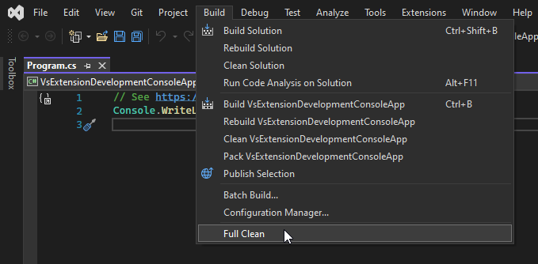

# visual-studio-solution-cleaner

Visual Studio extension to completly clean all "bin" and "obj" folders.

# Installation

You can find and install the extension in VS 2022 extension manager.
The extensions name is "Seddev Solution Cleaner", currently available as preview.

# Extension

The extension group is added to the Visual Studios "Build" menu tab.

After clicking "Full clean" all "bin" and "obj" folders of all projects in the currently opened solution are deleted.

